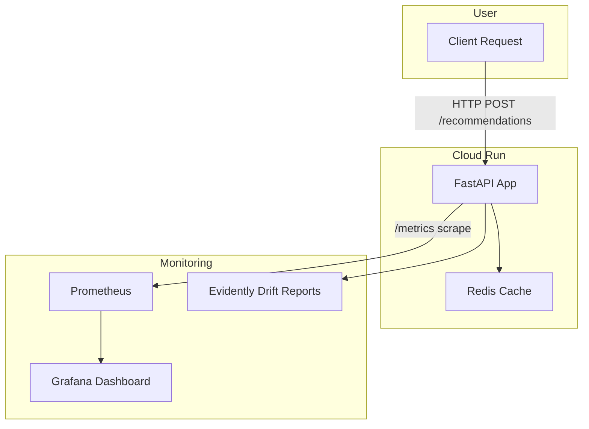

# Hybrid Recommender as a Service (RaaS)

A **hybrid recommendation engine** combining **collaborative filtering (ALS)** and **content-based item embeddings**, deployed as a **scalable FastAPI service** with full **MLOps integration** including CI/CD, drift detection, and Docker Compose-based monitoring stack.

>  **Live Endpoint:** [https://recs-mlops-382976591887.us-central1.run.app/](https://recs-mlops-382976591887.us-central1.run.app/)

---

## 🚀 Project Overview

This project demonstrates an **end-to-end MLOps workflow** for building, training, deploying, and monitoring a machine learning system in production.  
It serves personalized movie recommendations using a **hybrid blend** of collaborative filtering and semantic content embeddings derived from movie metadata.

---

## 🧰 Technical Stack

| Category | Tools & Frameworks |
|-----------|--------------------|
| **Data & ML** | `sentence-transformers`, `implicit (ALS)`, `numpy`, `pandas`, `scikit-learn` |
| **Experiment Tracking** | `MLflow` |
| **Data Versioning & Validation** | `DVC`, `Great Expectations` |
| **Serving & APIs** | `FastAPI`, `Uvicorn`, `Redis`, `FAISS` |
| **Monitoring** | `Prometheus`, `Grafana`, `Evidently AI` |
| **Orchestration** | `Prefect` |
| **Infrastructure & CI/CD** | `Docker`, `GitHub Actions`, `AWS S3`, `Google Cloud Run` |
| **Deployment Registry** | `GitHub Container Registry (GHCR)` |

---

## Modeling Approach

### 1. Collaborative Filtering (CF)
- Implemented using **Alternating Least Squares (ALS)** from the `implicit` library.
- Learns user–item latent factors from sparse interaction matrices.

### 2. Content-Based Features
- Extracts **semantic embeddings** for movie titles and genres using `sentence-transformers`.
- Stores dense vectors in `artifacts/features/hybrid_item_vecs.npy`.

### 3. Hybrid Strategy
- Scores are combined via a **weighted linear blend**:
  \[ score = 0.7 * CF + 0.3 * Content \]
- Tuned weights are logged in **MLflow** for experiment tracking.

### 4. Cold-Start Strategy
- Falls back to **most popular items** (by global interaction frequency).
- Ensures new users receive reasonable recommendations immediately.

---

## 📊 Evaluation

| Metric | Baseline (ALS) | Hybrid |
|---------|----------------|--------|
| **NDCG@10** | 0.080 | 0.085 |
| **Recall@10** | 0.076 | 0.082 |

- **Dataset:** [MovieLens 1M (ml-1m)](https://grouplens.org/datasets/movielens/1m/)
- Evaluation pipelines log all metrics to **MLflow** (`val_ndcg_10`, `val_recall_10`).

---

## ⚙️ Repository Structure

```

HybridRecommender/
├── src/
│   ├── etl/              # data preprocessing & matrix building
│   ├── features/         # content embedding generation
│   ├── train/            # model training scripts (ALS, hybrid)
│   ├── serve/            # FastAPI app, metrics, caching, logging
│   ├── monitoring/       # drift detection jobs
│   └── pipelines/        # Prefect retraining flow
│
├── infra/
│   ├── docker/           # Dockerfile + monitoring compose stack
│   ├── grafana/          # dashboard JSON templates
│   └── monitoring/       # Prometheus & Alertmanager configs
│
├── artifacts/            # models, features, and metrics (DVC-tracked)
├── data/                 # processed/interim MovieLens data
├── logs/                 # serving + feedback logs (ignored in Git)
├── Makefile              # quick commands
├── requirements.txt      # Python dependencies
├── params.yaml           # training configuration
├── dvc.yaml              # DVC pipeline definition
└── .github/workflows/ci.yml  # CI/CD pipeline

````

---

## 🧩 Serving API

| Endpoint | Method | Description |
|-----------|--------|-------------|
| `/recommendations` | `POST` | Generate top-K recommendations |
| `/similar/{item_id}` | `GET` | Retrieve FAISS-based similar items |
| `/feedback` | `POST` | Log user interactions (click, like, etc.) |
| `/health` | `GET` | Service health check |
| `/metrics` | `GET` | Prometheus metrics endpoint |

### Example Usage

```bash
curl --location 'http://localhost:8000/recommendations' \
--header 'Content-Type: application/json' \
--data '{
  "user_id": 75,
  "topk": 3,
  "blend_cf": 0.6,
  "blend_cont": 0.4
}'
````

**Response**

```json
{
  "user_id": 75,
  "cold_start": false,
  "items": [
    {"item_id": 2761, "title": "Iron Giant, The (1999)", "genres": "Animation|Children's"},
    {"item_id": 2394, "title": "Prince of Egypt, The (1998)", "genres": "Animation|Musical"},
    {"item_id": 2082, "title": "Mighty Ducks, The (1992)", "genres": "Children's|Comedy"}
  ]
}
```

---

## 📈 Monitoring & Automation

### Drift Detection

* **Evidently AI** computes data and prediction drift using recent serving logs (`data/serving_logs.parquet`).
* Reports stored under `artifacts/monitoring/drift_report.html`.

> 📊 [View Example Drift Report](https://github.com/AgnelFernando/HybridRecommender/blob/main/artifacts/monitoring/drift_report.html)

### Metrics Observability

* **Prometheus** scrapes `/metrics` endpoint.
* **Grafana** visualizes:

  * p95 latency
  * request rate (QPS)
  * cache hit ratio
  * recommendation strategy usage
  * error rates
 
  


### Automated Retraining

* **Prefect Flow (`src/pipelines/retrain_flow.py`)** orchestrates:

  * Daily ETL
  * Model retraining
  * Evaluation & promotion if improved
  * MLflow artifact registration

---

## 🔄 CI/CD Pipeline

* **GitHub Actions** workflow (`.github/workflows/ci.yml`) automates:

  1. Pull latest versioned data via DVC (from S3)
  2. Run unit tests and smoke tests
  3. Build Docker image → tag → push to **GitHub Container Registry (GHCR)**
  4. Auto-deploy to **Google Cloud Run**

**Deployment Target:**
`https://recs-mlops-382976591887.us-central1.run.app/`

---

## 🧱 Infrastructure & Monitoring Stack



---

## 🧪 Local Development

### 1. Environment Setup

```bash
conda env create -f environment.yml
conda activate recs-mlops
```

### 2. Train & Evaluate

```bash
make train
```

### 3. Serve Locally

```bash
make serve
```

### 4. Launch Monitoring Stack

```bash
cd infra/docker/monitoring
docker compose up --build
```

### 5. Generate Drift Report

```bash
make monitor-drift
```

---

## 📸 Results

* **Model Metrics:**

  * NDCG@10 = **0.085**
  * Recall@10 = **0.082**
* **Average API Latency:** ~40–60 ms (local)
* **Monitoring Stack:** Prometheus + Grafana + Evidently
* **Example Drift Report:** `artifacts/monitoring/drift_report.html`

---

## 🧩 Future Enhancements

* Add **bandit-based reranker** for adaptive personalization
* Integrate **Feature Store (Feast)** for real-time user/item features
* Extend CI/CD to full **blue-green deployment** with Canary traffic split
* Add **model explainability** dashboards (SHAP/Permutation importances)

---

## ⚖️ License

This project is open-source under the **MIT License**.
See [`LICENSE`](LICENSE) for details.

```

---

Would you like me to also include:
- A **badge row** at the top (build status, license, Python version, etc.)
- A minimal **architecture diagram PNG** (I can generate a placeholder using Mermaid or a small graphic for GitHub)?
```
